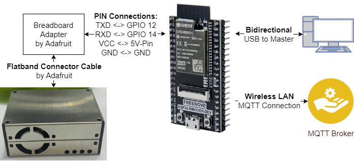

# ESP32 MQTT PMS5003

The Internet of Things (IoT) course at the Berlin University of Applied Sciences deals with various aspects and technologies to create the implementation of sensors, devices and software applications for a resource-saving, interoperable system landscape. With this in mind, the focus in the practical education is set on [MQTT](https://mqtt.org/). MQTT is a communication protocol standardized by [OASIS](https://groups.oasis-open.org/home), especially for IoT applications. In the following, the use of MQTT is realized experimentally by means of a particle sensor and a microcontroller. The network and MQTT broker required for MQTT are provided by the laboratory and are not the subject of this repository. The aim is to read out the particle sensor data at regular intervals and send it to the broker using a separate topic.

## Contributors

| Contributor  | Alias      | Contact                                                                                                                                                                                                                                                                                                                                                                                                                  |
| ------------ | ---------- | ------------------------------------------------------------------------------------------------------------------------------------------------------------------------------------------------------------------------------------------------------------------------------------------------------------------------------------------------------------------------------------------------------------------------ |
| Merlin Seela | IAmAMerlin |    |
| Thomas Zimmermann | Zimpto |  |

## How to use this repository

### Obtain the Source Code

You can acquire the Source Code by simply installing [git](https://git-scm.com/), opening a terminal and executing `git clone https://github.com/merlinseela/MQTT_Dustsensor_EST32.git`. It will download the source code.

### Acquire Required Software and Hardware
_Note: This is not binding but if you decide to get other Software and/or Hardware the Code most likely will not work without adjustments._

This repository was build using [Visual Studio Code](https://code.visualstudio.com/) and [ESP-IDF Extension by Espressif](https://docs.espressif.com/projects/esp-idf/en/v4.2.3/esp32/get-started/vscode-setup.html).

Hardware:

- [Freenove ESP32 Wroom Board](https://github.com/Freenove/Freenove_ESP32_WROOM_Board)
- [PMS5003 Sensor Kit by Adafruit](https://www.adafruit.com/product/3686)

### Instructions

1. Setup the Hardware as shown in this map. 

_Note: It is assumed you have a working MQTT-Broker running._

2. Download and install Visual Studio Code.
3. Open Visual Studio Code. 
4. Open the Extension Tab and search for `ESP-IDF`. Install the Extension.
5. In the Menu choose `File` -> `Open Folder`. Navigate to the Source Code Folder you cloned earlier and open it.
6. Open the Command Palette in VS-Code and Search for `ESP-IDF: SDK Configuration Editor` and select the corresponding entry. A new Tab should open. (_Note:May take a while due to server configuration._)
7. In the Configuration search with keyword `wifi` and enter the `WiFi SSID` and `WiFi Password` which hosts the MQTT Broker.
8. In the Configuration search with keyword `broker` and enter the `Broker URL` of you MQTT-Broker.
9. Assuming you already connected your ESP open the command Palette again, search for `ESP-IDE: Select Port to Use` and select the right port.
10. Open the Command Palette again and search for `ESP-IDF: Build, Flash and Start a Monitor on your Device` and execute it. _Note: If asked which Protocol to use, select `UART`._

If everything was setup right the application should be build, flashed and monitored on the PC while also sending data via MQTT to your Broker.

Happy Coding!