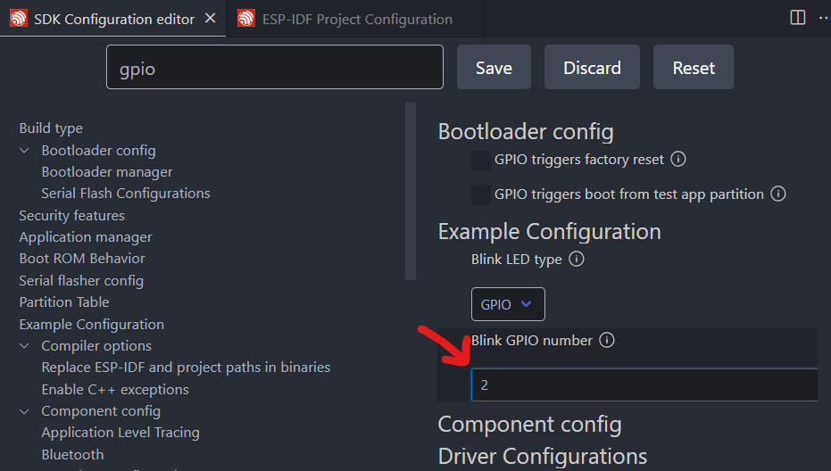

# Uebung 01

# Aufgabe 1
Aufgabe: Ändern Sie das Projekt nun so, dass die blaue LED auf dem ESP32-WROVER-DEV
Board blinkt:

1. Welchen GPIO müssen Sie verwenden?
GPIO PIN 02 siehe [Freenova ESP32 Pinmap](https://github.com/Freenove/Freenove_ESP32_WROVER_Board/blob/main/ESP32_Pinout.png)

2. Wo nehmen Sie die Änderung vor?


_Hinweis: hier ist der file wo man es "ändern" kann wenn es nicht beim builden aus dem SDK Configuration Editor geladen wird..._
Im sdkconfig.h file (unter: build/config/sdkconfig.h) -> Tipp von Joseph: "In der build config was zu ändern nicht so sinnvoll." -> In der eigentlichen sdkconfig.h unter "./sdkconfig.h".

Dann nach `#define CONFIG_BLINK_GPIO 5` suchen und den Wert von `5` auf `2` ändern.

# Aufgabe 2
Aufgabe: Erstellen Sie auf Basis der leeren main.c erneut eine Anwendung, die die blaue LED blinken lässt! Als include Dateien sollen nur verwendet werden:

- ”freertos/FreeRTOS.h”
- ”freertos/task.h”
- ”driver/gpio.h”
- ”esp log.h”

Lösung siehe `blink_selfmade` Projekte.

# Aufgabe 3
Nach dem erfolgreichen, erstellen, bauen und flashen ist folgendes Monitoring zu sehen:

```
rst:0xc (SW_CPU_RESET),boot:0x13 (SPI_FAST_FLASH_BOOT)
configsip: 0, SPIWP:0xee
clk_drv:0x00,q_drv:0x00,d_drv:0x00,cs0_drv:0x00,hd_drv:0x00,wp_drv:0x00
mode:DIO, clock div:2
load:0x3fff0030,len:7172
load:0x40078000,len:15540
load:0x40080400,len:4
0x40080400: _init at ??:?

ho 8 tail 4 room 4
load:0x40080404,len:3904
entry 0x40080640
I (31) boot: ESP-IDF v5.2.1 2nd stage bootloader
I (31) boot: compile time May 21 2024 15:29:27
I (31) boot: Multicore bootloader
I (35) boot: chip revision: v3.0
I (39) boot.esp32: SPI Speed      : 40MHz
I (44) boot.esp32: SPI Mode       : DIO
I (48) boot.esp32: SPI Flash Size : 2MB
I (53) boot: Enabling RNG early entropy source...
I (58) boot: Partition Table:
I (62) boot: ## Label            Usage          Type ST Offset   Length
I (69) boot:  0 nvs              WiFi data        01 02 00009000 00006000
I (76) boot:  1 phy_init         RF data          01 01 0000f000 00001000
I (84) boot:  2 factory          factory app      00 00 00010000 00100000
I (91) boot: End of partition table
I (96) esp_image: segment 0: paddr=00010020 vaddr=3f400020 size=09614h ( 38420) map
I (117) esp_image: segment 1: paddr=0001963c vaddr=3ffb0000 size=0220ch (  8716) load
I (121) esp_image: segment 2: paddr=0001b850 vaddr=40080000 size=047c8h ( 18376) load
I (130) esp_image: segment 3: paddr=00020020 vaddr=400d0020 size=135c8h ( 79304) map
I (159) esp_image: segment 4: paddr=000335f0 vaddr=400847c8 size=07f88h ( 32648) load
I (178) boot: Loaded app from partition at offset 0x10000
I (178) boot: Disabling RNG early entropy source...
I (190) cpu_start: Multicore app
I (198) cpu_start: Pro cpu start user code
I (199) cpu_start: cpu freq: 160000000 Hz
I (199) cpu_start: Application information:
I (202) cpu_start: Project name:     hello_world
I (207) cpu_start: App version:      b0d10f2
I (212) cpu_start: Compile time:     May 21 2024 15:29:02
I (218) cpu_start: ELF file SHA256:  1d25f736a...
I (223) cpu_start: ESP-IDF:          v5.2.1
I (228) cpu_start: Min chip rev:     v0.0
I (233) cpu_start: Max chip rev:     v3.99 
I (238) cpu_start: Chip rev:         v3.0
I (243) heap_init: Initializing. RAM available for dynamic allocation:
I (250) heap_init: At 3FFAE6E0 len 00001920 (6 KiB): DRAM
I (256) heap_init: At 3FFB2AD0 len 0002D530 (181 KiB): DRAM
I (262) heap_init: At 3FFE0440 len 00003AE0 (14 KiB): D/IRAM
I (268) heap_init: At 3FFE4350 len 0001BCB0 (111 KiB): D/IRAM
I (275) heap_init: At 4008C750 len 000138B0 (78 KiB): IRAM
I (282) spi_flash: detected chip: generic
I (286) spi_flash: flash io: dio
W (289) spi_flash: Detected size(4096k) larger than the size in the binary image header(2048k). Using the size in the binary image header.
I (303) main_task: Started on CPU0
I (313) main_task: Calling app_main()
Hello world!
This is esp32 chip with 2 CPU core(s), WiFi/BTBLE, silicon revision v3.0, 2MB external flash
Minimum free heap size: 300876 bytes
Restarting in 10 seconds...
Restarting in 9 seconds...
Restarting in 8 seconds...
Restarting in 7 seconds...
Restarting in 6 seconds...
Restarting in 5 seconds...
Restarting in 4 seconds...
Restarting in 3 seconds...
Restarting in 2 seconds...
Restarting in 1 seconds...
Restarting in 0 seconds...
Restarting now.
ets Jul 29 2019 12:21:46
```

# Aufgabe 4
Aufgabe: Erstellen Sie erneut ein blinkendes LED Projekt und laden Sie diesen auf das ESP32-WROVER-DEV Board. **(in Platform IO)!**

Wenn gebaut und ausgeführt gleiches verhalten wie vorher.

Lösungshinweise:
- Code kann bis auf die Änderung der PIN nummer als INT auf Enumeration übernommen werden.
- Funktionen müssen folgendermaßen kopiert werden:
    - `configure_led()` call in `setup()` -> Konfiguration nur einmal ausführen bei Arduino!
    - log code und `blink_led` in `loop()` -> Schleifen code wir immer wieder ausgeführt!
    - Rest sind Funktionen die unter dem Kommentar `// put function declarations here:` gepackt werden.

Notes:
- Eine Menge GPIO Enumerations can be found in `gpio_types.h`